# New York City Motor Vehicles Collisions Data Integration & Analytics

 

 

## Problem Definition

In this dataset sourced from NYC Open Data portal and NYPD website, we need to design and implement a data engineering solution that can integrate, transform, and load this data into a centralized data warehouse, enabling the data analysts and scientists to easily access and analyze it. The solution must be scalable, resilient, and secure, able to handle increasing data volumes and diverse data types while ensuring data integrity and compliance with data protection regulations. The ultimate goal of this data engineering solution is to enable our organization to make data-driven decisions, improve customer engagement, and drive business growth. Statistical information on motor vehicle collisions is made available for public users to access. The data is updated on a monthly basis, and grouped by borough intersections, bridges, and tunnels.

## Learning

This project has a strong emphasis on applied learning. I got to analyze the motor vehicle and traffic accidents happening in New York City, using information from the NYC Open Data portal and NYPD Public data to build a data engineering pipeline involving data extraction, data cleansing, transformation, exploratory analysis, data visualization, and data flow orchestration of event data on the cloud.

## Data Source

**New York City Traffic Data/Motor Vehicle Collisions** - The project leverages various data sources like Crashes, Vehicles and Persons from Open Data as desribed below. All the datasets and the information on the Motor Vehicle Collisions come from the same data source. 

- [Motor Vehicle Collisions - Crashes](https://data.cityofnewyork.us/Public-Safety/Motor-Vehicle-Collisions-Crashes/h9gi-nx95) - The Motor Vehicle Collisions crash dataset contains details on the crash event. Each row represents a crash event. The Motor Vehicle Collisions data contain information from all police reported motor vehicle collisions in NYC. The police report (MV104-AN) is required to be filled out for collisions where someone is injured or killed, or where there is at least $1000 worth of damage (https://www.nhtsa.gov/sites/nhtsa.dot.gov/files/documents/ny_overlay_mv-104an_rev05_2004.pdf). It should be noted that the data is preliminary and subject to change when the MV-104AN forms are amended based on revised crash details.

- [Motor Vehicle Collisions - Vehicles](https://data.cityofnewyork.us/Public-Safety/Motor-Vehicle-Collisions-Vehicles/bm4k-52h4) - The Motor Vehicle Collisions vehicle dataset contains details on each vehicle involved in the crash. Each row represents a motor vehicle involved in a crash. The data in this dataset goes back to April 2016 when crash reporting switched to an electronic system.

- [Motor Vehicle Collisions - Person](https://data.cityofnewyork.us/Public-Safety/Motor-Vehicle-Collisions-Person/f55k-p6yu) - The Motor Vehicle Collisions person dataset contains details for people involved in the crash. Each row represents a person (driver, occupant, pedestrian, bicyclist,..) involved in a crash. The data in this source goes back to April 2016 when crash reporting switched to an electronic system.

Under Eric L. Adams's comprehensive traffic safety initiative, Vision Zero, and in an effort to improve street safety in every neighborhood and reduce traffic-related injuries and deaths, the NYPD aggressively targets drivers who:

- Speed
- Operate mobile devices while driving
- Drive drunk
- Fail to yield to pedestrians
- Fail to stop at red lights and stop signs

This section contains statistical information on moving violation summonses, motor vehicle collisions, and instances of leaving the scene of an incident, as well as access to the Department's raw feed of traffic-related data which is used for the Traffic Safety Forum

## Data Description

This dataset consists of below metadata information:

|              Data Source             |   Rows   |   Columns   |  Update Frequency |   File Format  |
|:------------------------------------:|:--------:|:-----------:|:-----------------:|:--------------:|
|               Crashes                |   1.95M  |       29    |       Daily       |      csv       |
|               Vehicles               |   3.705M |       25    |       Daily       |      csv       |
|               Persons            	   |   4.90M  |       21    |       Daily       |      csv       |

## Tools 

Below tools have been utilized for the various segments involving Data Profiling, Modeling, Integration and BI Reporting and Visualizations:

  
     
		
 	
     

 

  
     
		
 	
  	
     

 

  
     
 	
 

 

  
     
 	
 

## Data Modeling

This project leverages the capability of ER/Studio Data Architect to design, visualize, and manage data models and metadata for the database. ER/Studio allowed to create conceptual, logical, and physical data models and map the relationships and dependencies between them. The methodology of data modeling has been an iterative process of design, review, feedback and enhancements adhering the business and end-user requirements.

  
   
	<a href="#">
        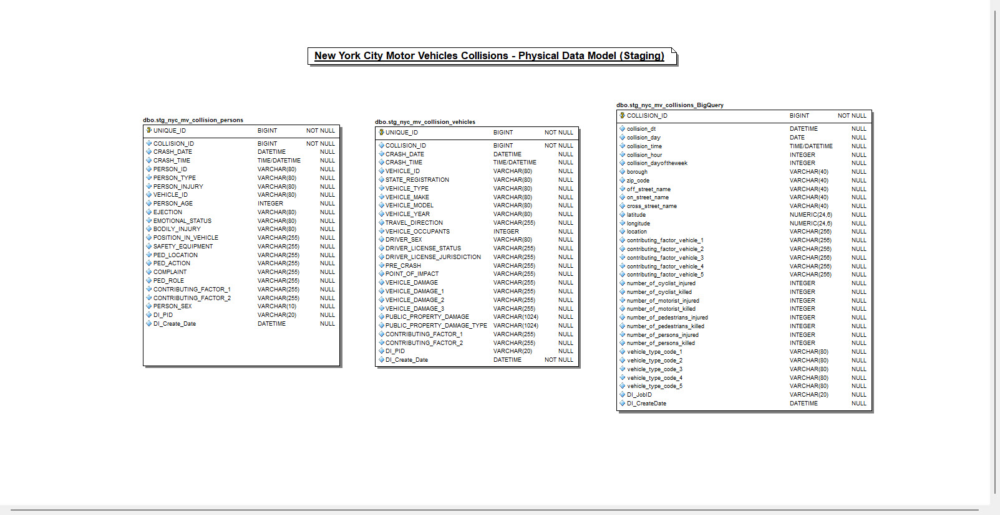 
  </a>		
     
	Figure 1 : New York City Motor Vehicles Collisions Stage Data Model

 

  
   
	<a href="#">
        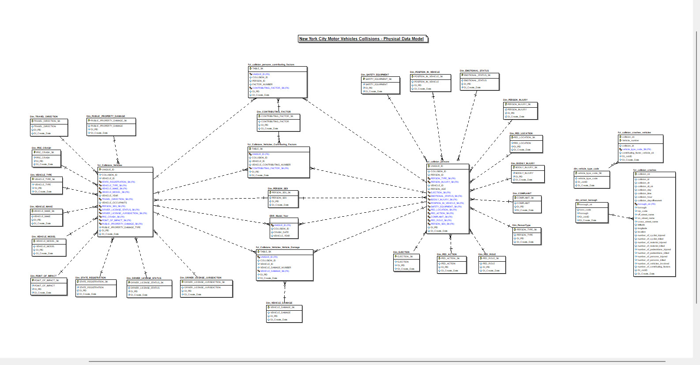 
  </a>		
     
	Figure 2 : New York City Motor Vehicles Collisions Dimensional Data Model

 

## Data Integration / ETL Pipeline

In this project, data is analysed, profiled, transformed and loaded into Microsoft SQL server by Talend and Alteryx. Data is collected from BigQuery and flat files (csv/tsv) and is moved to landing zones (Stage) in SQL Server.

The ETL process involved 2 layer of data landing, transformation and loading.
- **Landing or Staging Data Layer**: The data is extracted form source and staged into the SQL Server database. Here the main focus is to land the data from source with minimal transformation (as-is data load). Also, ETL Audit fields such as DI_PID, DI_Create_Date etc. were added to identify newly loaded or updated records by using audit columns.

	|              Schema                      |             Table  	   |
	|:----------------------------------------:|:-----------------------------:|
	|               NYC_MV                |    STG_NYC_MV_COLLISIONS_BIGQUERY  |
	|               NYC_MV                |    STG_NYC_MV_COLLISION_VEHICLES   |
	|               NYC_MV                |    STG_NYC_MV_COLLISION_PERSONS    |
	

  
   
	<a href="#">
        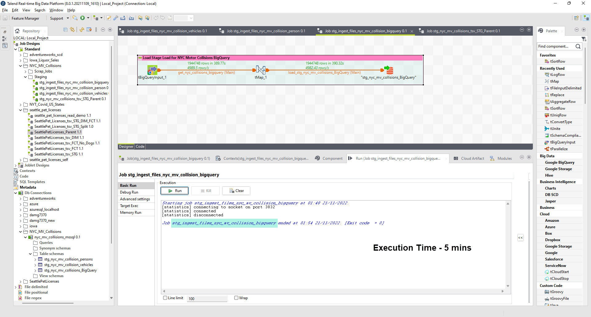 
  </a>		
     
	Figure 3 : New York City Motor Vehicle Collisions BigQuery Data Staging Workflow

 

  
   
	<a href="#">
        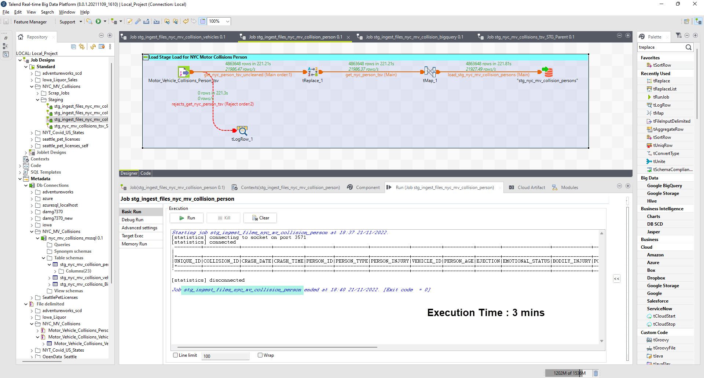 
  </a>		
     
	Figure 3 : New York City Motor Vehicle Collisions Persons Data Staging Workflow

 

  
   
	<a href="#">
        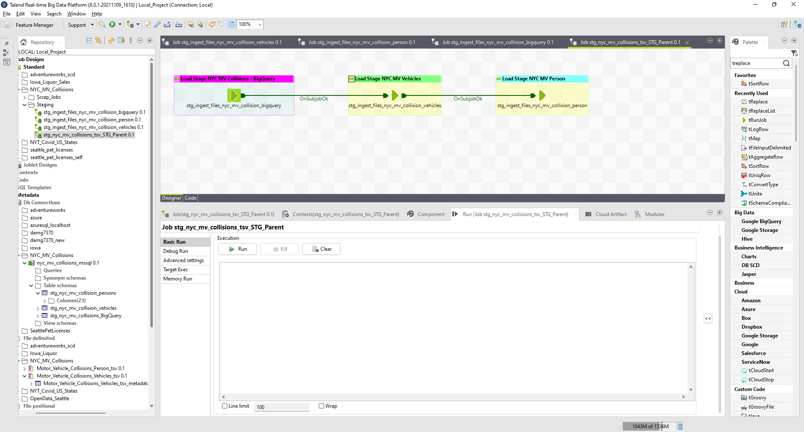 
  </a>		
     
	Figure 3 : New York City Motor Vehicle Collisions - Staging Workflow Orchestration

 

- **Dimensional Data Layer**: Data is loaded to multi-fact dimensional data warehouse after performing extraction from Stage and transformation with defined rules and performed data quality checks post data load. I also addded DI attributes (audit columns) to each dimension and fact for record audit and maintenance. Also, below are few workflows to load some dimensions and facts tables.

	|              Schema                  |             Table  	   |
	|:------------------------------------:|:-------------------------:|
	|               NYC_MV                 |    Dim_vehicle_type_code  |
	|               NYC_MV                 |    fct_collision_persons  |
	|               NYC_MV                 |    fct_collision_crashes  |
	|               NYC_MV                 |    fct_Collisions_Vehicles  |
	|               NYC_MV                 |    fct_collision_crashes_vehicles  |
	|               NYC_MV                 |    fct_collision_persons_contributing_factors  |
	|               NYC_MV                 |    fct_Collisions_Vehicles_Contributing_Factors  |
	|               NYC_MV                 |    fct_Collisions_Vechicles_Contributing_Factors_Tnx  |
	|               NYC_MV                 |    fct_collision_persons_contributing_factors_Tnx  |
	|               NYC_MV                 |    fct_Collisions_Vehicles_Vehicle_Damage  |
	|               NYC_MV                 |    stg_nyc_mv_collision_vehicles  |
	|               NYC_MV                 |    ERR_Model_Year  |
	|               NYC_MV                 |    ERR_Person_Age  |
	|               NYC_MV                 |    stg_nyc_mv_collision_persons  |
	|               NYC_MV                 |    dim_arrest_borough  |
	|               NYC_MV                 |    fct_Collisions_Vehicles_Vehicle_Damage_Tnx  |
	|               NYC_MV                 |    Dim_COMPLAINT  |
	|               NYC_MV                 |    Dim_CONTRIBUTING_FACTOR  |
	|               NYC_MV                 |    Dim_DRIVER_LICENSE_JURISDICTION  |
	|               NYC_MV                 |    Dim_DRIVER_LICENSE_STATUS  |
	|               NYC_MV                 |    Dim_EJECTION  |
	|               NYC_MV                 |    Dim_VEHICLE_TYPE  |
	|               NYC_MV                 |    Dim_POSITION_IN_VEHICLE  |
	|               NYC_MV                 |    Dim_PRE_CRASH  |
	|               NYC_MV                 |    Dim_SAFETY_EQUIPMENT  |
	|               NYC_MV                 |    Dim_STATE_REGISTRATION  |
	|               NYC_MV                 |    Dim_TRAVEL_DIRECTION  |
	|               NYC_MV                 |    Dim_EMOTIONAL_STATUS  |
	|               NYC_MV                 |    Dim_PED_LOCATION  |
	|               NYC_MV                 |    Dim_PED_ACTION  |
	|               NYC_MV                 |    Dim_PED_ROLE  |
	|               NYC_MV                 |    Dim_PersonType  |
	|               NYC_MV                 |    Dim_POINT_OF_IMPACT  |
	|               NYC_MV                 |    Dim_PUBLIC_PROPERTY_DAMAGE  |
	|               NYC_MV                 |    Dim_VEHICLE_DAMAGE  |	
 

  
   
	<a href="#">
        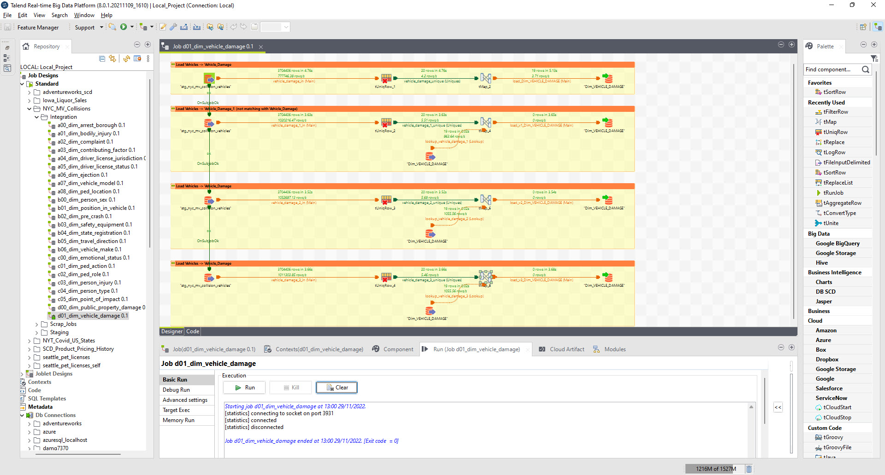
  </a>		
     
	Figure 4 : New York City Motor Vehicle Dimensional Workflow (Vehicle Damage)

 

  
   
	<a href="#">
        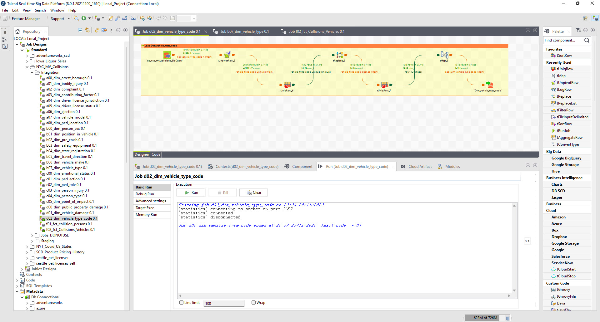
  </a>		
     
	Figure 4 : New York City Motor Vehicle Dimensional Workflow (Vehicle Type)

 

  
   
	<a href="#">
        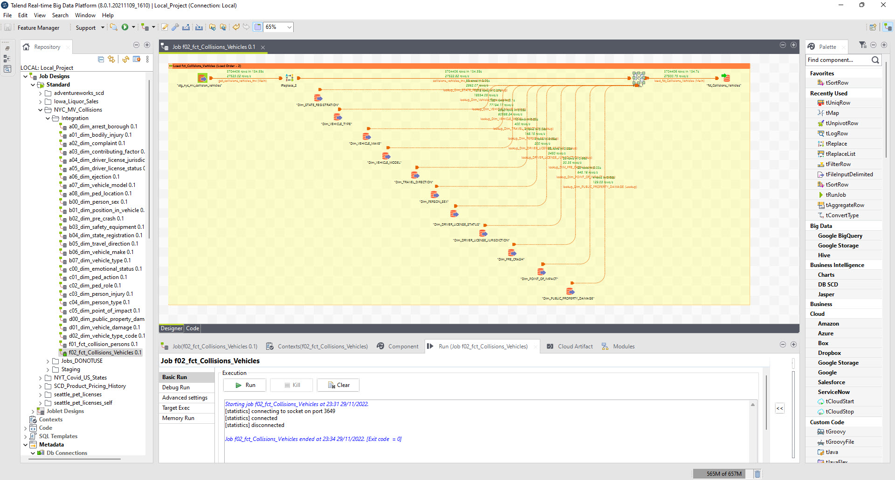
  </a>		
     
	Figure 4 : New York City Motor Vehicle Fact Workflow (Collisions Vehicles)

 

  
   
	<a href="#">
        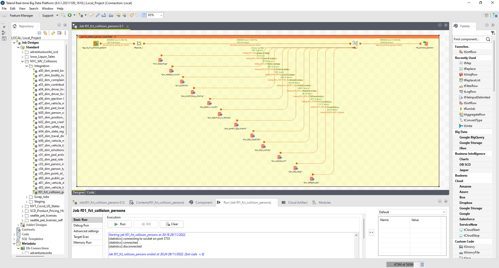
  </a>		
     
	Figure 4 : New York City Motor Vehicle Fact Workflow (Collisions Persons)

 

  
   
	<a href="#">
        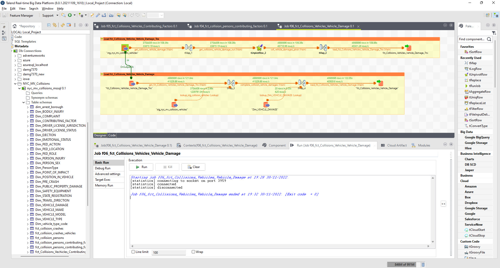
  </a>		
     
	Figure 4 : New York City Motor Vehicle Fact Workflow (Collisions Vehicle Damages)

 

  
   
	<a href="#">
        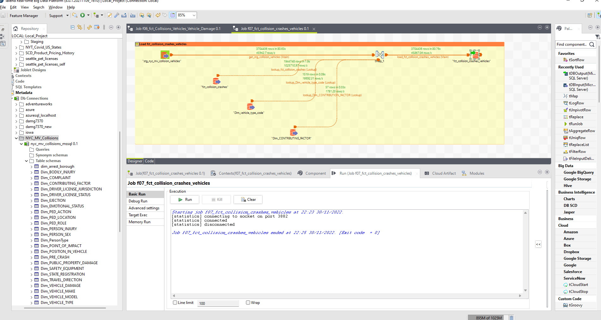
  </a>		
     
	Figure 4 : New York City Motor Vehicle Fact Workflow (Crashes Vehicles)

 

  
   
	<a href="#">
        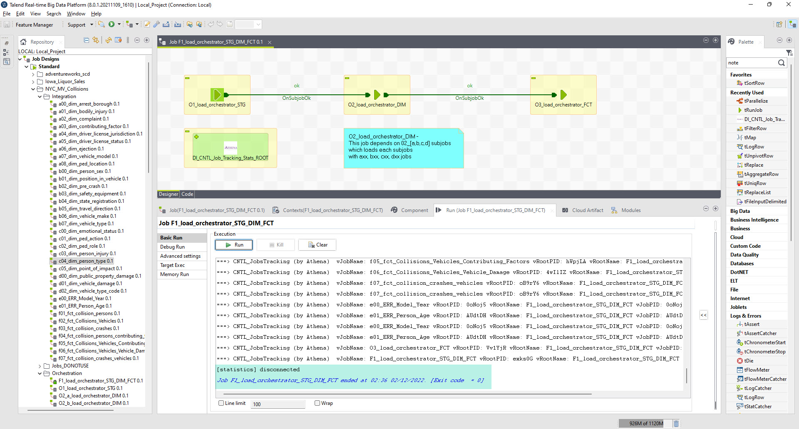
  </a>		
     
	Figure 4 : New York City Motor Vehicle Workflows Orchestration (DI Control Jobs)

 

  
   
	<a href="#">
        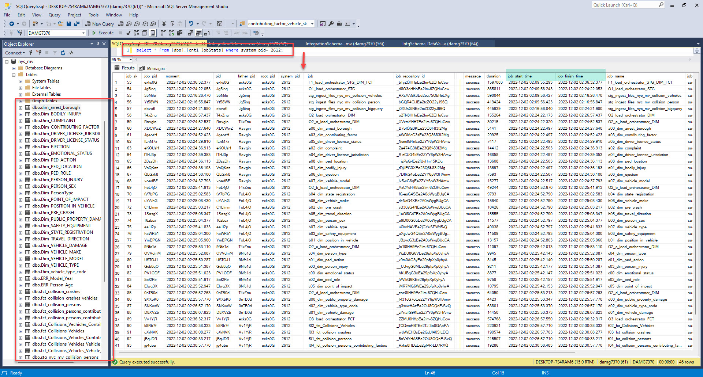
  </a>		
     
	Figure 4 : New York City Motor Vehicle Data Load Statistics (Integration System)

 
